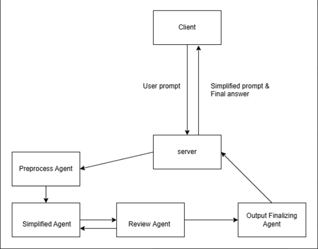
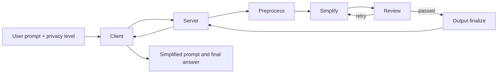

# AI For Good Hackathon

## Challenge 🎯

Build agentic AI solutions that deliver measurable impact for people, planet, and trust in at least one area.

- **Impact:** Increase access, reduce friction, and improve outcomes for end beneficiaries.
- **Sustainability:** Measure, reduce, or optimize environmental and operational footprint.
- **Trust & Responsible AI:** Build with safety-by-design so the solution can be used responsibly in real settings.

## Project Description 🗒️

This project implements a multi-agent pipeline that preprocesses, simplifies, and reviews user prompts before sending them to an LLM—removing redundant detail and sensitive information where possible (data minimization for **Trust & Responsible AI**).

The app mimics a ChatGPT-style experience with configurable privacy levels (low / medium / high). A simplification agent chain produces a minimized prompt and a final answer for the user.

**Benefit:** Less sensitive data in transit and fewer tokens, while stripping noise from messy prompts so the model can answer more accurately.

## Tech Stack 💻

- **Design:** Figma
- **Frontend:** Vite + React + Tailwind + Shadcn UI
- **Backend:** Node.js + TypeScript + Express + Docker
- **AI/LLM:** LangGraph + Groq + OpenRouter + HuggingFace
- **Deploy:** Vercel + Render

## Team Members 👷

- [Khoi Do](https://github.com/khoidm2004): Lead Developer, Backend Developer, AI Developer
- [Dung Nguyen](https://github.com/pjazzy314159): Algorithms Developer, AI Developer, Backend Developer
- [Nhi Nguyen](https://github.com/nhingnguyen): Designer, Frontend Developer
- [Khoa Nguyen](https://github.com/Hkhoa25): Designer, Frontend Developer

## Project Architecture 🖥️

### User input flow

1. **Client** — The user sends a prompt and chooses a privacy level (**low** / **medium** / **high**), which sets how aggressively the pipeline compresses and redacts input.
2. **Server** — The frontend calls the API (e.g. `POST /api/pipeline/run`) with the raw message and `simplify` level; the server starts the graph with `originalMessage` and `compressionLevel`.
3. **Preprocess agent** — Fixes typos and grammar so later steps work on clean text (`preprocessedMessage`).
4. **Simplify agent** — Masks PII, drops low-salience noise (rule-based + algorithmic compression), then rewrites the core question with an LLM (`simplifiedMessage`).
5. **Review agent** — Checks that the simplified prompt still matches the user’s intent (quick rules + optional LLM review). If it fails and retries remain, the pipeline loops back to **Simplify** with slightly looser thresholds (up to three attempts).
6. **Output finalizing agent** — When review passes (or max retries are reached), builds the client payload: approved **simplified question**, **final answer** (LLM), and review metadata (`status`, similarity, missing items, retry history).
7. **Client** — The server returns **simplified prompt** and **final answer** so the user sees what was sent to the model and the reply—without exposing the full raw pipeline on every screen.

| Stage | What happens to user input |
|-------|----------------------------|
| Preprocess | Grammar and typos corrected |
| Simplify | PII redacted, filler removed, intent-focused question |
| Review | Validates meaning; may re-run simplify |
| Output | Answer generated from the approved simplified question |
