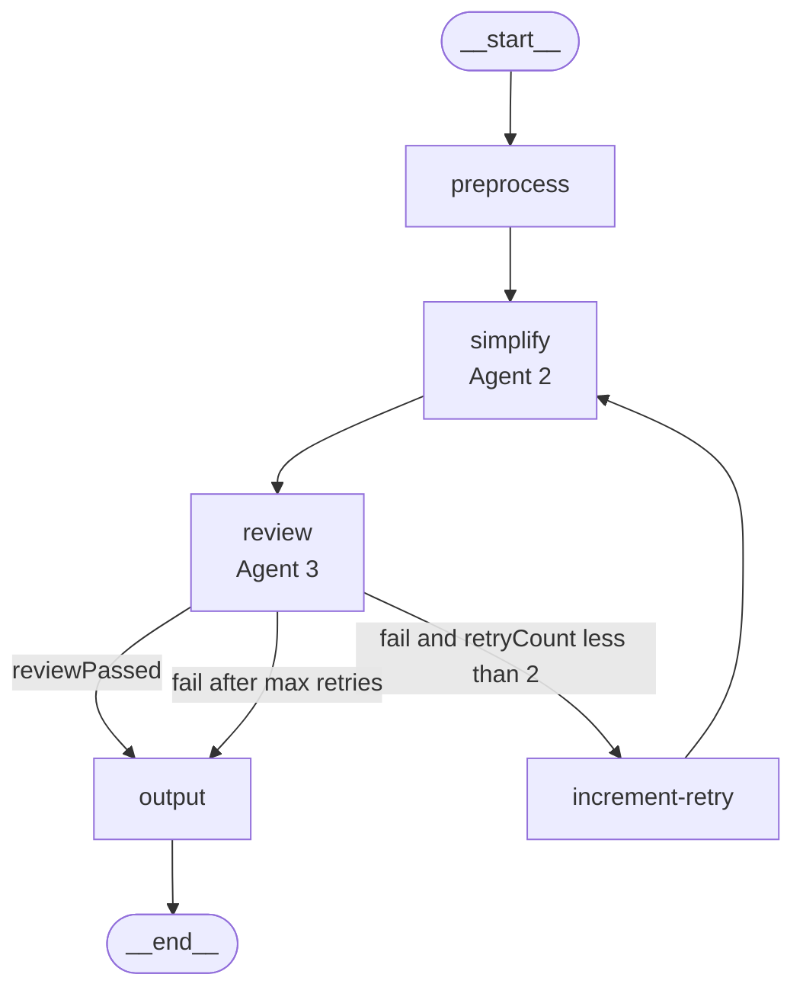
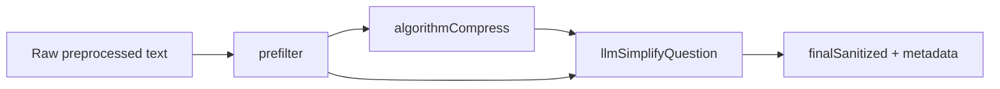
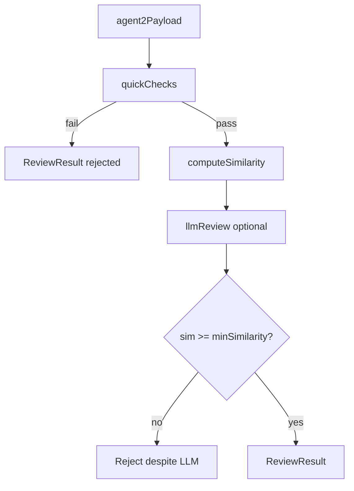

# Multi-agent pipeline workflow

This document describes how the backend text pipeline works: the LangGraph orchestration in `backend/src/agents/`, the algorithm libraries in `backend/src/agents/lib/`, and how data flows from the API to the final JSON response.

---

## High-level architecture

The system is a **sequential multi-agent pipeline** with a **review-and-retry loop**. Each “agent” is either an LLM call (Groq) or a deterministic algorithm module in `lib/`.

| Stage | Node | Primary implementation | Role |
|-------|------|------------------------|------|
| Agent 0 | `preprocess` | `nodes/preprocess.node.ts` + Groq | Fix typos and grammar |
| Agent 2 | `simplify` | `lib/context-simplifier.ts` | Privacy-aware compression + question simplification |
| Agent 3 | `review` | `lib/reviewer.ts` | Validate simplified text vs original intent |
| — | `increment-retry` | `nodes/increment-retry.node.ts` | Bump retry counter |
| Final | `output` | `nodes/output.node.ts` + Groq | Build structured JSON for the client |

Orchestration uses **LangGraph** (`@langchain/langgraph`) in `graphs/pipeline.graph.ts`. Shared state is defined in `state/pipeline.state.ts`.

---

## Graph flow



### Conditional routing (review node)

After each review:

1. **`reviewPassed === true`** → go to `output` (success path).
2. **`reviewPassed === false` and `retryCount < 2`** → `increment-retry` → back to `simplify` (up to **3** simplify/review attempts: `retryCount` 0, 1, then 2).
3. **Otherwise** → still go to `output` (failure path with `status: "failed"` in JSON).

`retryCount` uses a **sum reducer** in state: each `increment-retry` adds `1`.

### API input → state

`POST /api/pipeline/run` body field `simplify` maps to `compressionLevel` in graph state:

| API `simplify` | State `compressionLevel` | Meaning |
|----------------|--------------------------|---------|
| `low` | `low` | Light compression, lenient similarity |
| `medium` (default) | `medium` | Balanced |
| `high` | `high` | Strong compression, stricter similarity |

If `compressionLevel` is empty, simplify skips Agent 2 algorithms and passes `preprocessedMessage` through unchanged.

---

## Shared pipeline state

Defined in `state/pipeline.state.ts`:

| Field | Type | Set by | Purpose |
|-------|------|--------|---------|
| `originalMessage` | `string` | API / invoke | Raw user input |
| `preprocessedMessage` | `string` | `preprocess` | Grammar-corrected text |
| `simplifiedMessage` | `string` | `simplify` | Agent 2 output (sanitized question) |
| `reviewPassed` | `boolean` | `review` | Agent 3 approval |
| `finalOutput` | `string` | `review` (interim), `output` (final JSON) | Client-facing payload |
| `compressionLevel` | `string` | API | `low` / `medium` / `high` |
| `retryCount` | `number` | `increment-retry` | Retry attempt index |

**Module-level state** (not in LangGraph): `simplify.node.ts` keeps `lastAgent2Result`, `retryHistory`, and attempt numbers so `review` and `output` can access full Agent 2 metadata. This is **single-request oriented**; concurrent pipeline runs on one process can interfere unless you isolate workers.

---

## Processing by node

### 1. Preprocess (`preprocess.node.ts`)

- **Type:** LLM-only (no `lib/` algorithms).
- **Model:** Groq via `services/groq.client.ts`.
- **Behavior:** System prompt asks for typo/grammar fixes only; returns corrected plain text as `preprocessedMessage`.

### 2. Simplify — Agent 2 (`simplify.node.ts` + `lib/context-simplifier.ts`)

**Entry:** `simplifyContext(preprocessedMessage, compressionLevel, minSimilarityThreshold)`.

**Retry-aware compression:** On retries, effective level may step down (e.g. user chose `high` → attempts use `high`, then `medium`, then `low`). See `retryLevels` in `simplify.node.ts`.

**Similarity threshold for precheck** (used inside Agent 2 and again in review):

```text
base = { low: 0.15, medium: 0.5, high: 0.75 }[compressionLevel]
threshold = max(0.15, base - retryCount * 0.1)
```

Each retry slightly lowers the bar so a less aggressive simplification can pass.

#### Agent 2 internal pipeline



| Phase | Function | Algorithm type |
|-------|----------|----------------|
| Prefilter | `prefilter` → `maskPii` | Rule-based regex (`patterns.ts`) |
| Algorithmic compress | `algorithmCompress` | Salience + SVT + Top-k + Noisy KNN (`similarity.ts`) |
| LLM simplify | `llmSimplifyQuestion` | Groq JSON question rewrite (`llm-chat.ts`) |
| Post-check | `computeSimilarity`, `containsPii` | Lexical cosine + regex |

The **LLM always receives full preprocessed text**, not only algorithmically kept clauses, so it can find the real question at the end of a long ramble.

### 3. Review — Agent 3 (`review.node.ts` + `lib/reviewer.ts`)

**Entry:** `reviewAgent3(originalMessage, agent2Output, { useLlm: true, minSimilarity })`.

Uses `getLastAgent2Result()` when available; otherwise falls back to `simplifiedMessage`.

Every review appends to **`retryHistory`** via `addAttemptToHistory()` (scores, reasons, missing items).

#### Agent 3 internal pipeline



| Step | Function | What it checks |
|------|----------|----------------|
| Quick checks | `quickChecks` | Non-empty output; no leftover PII; lexical similarity vs adaptive threshold (0.08–0.15) |
| LLM review | `llmReview` | Intent, key decisions, constraints preserved (JSON verdict) |
| Similarity floor | in `reviewAgent3` | Even if LLM approves, reject if `sim < minSimilarity` |
| Fallback | `fallbackReview` | If LLM JSON parse fails: `sim >= 0.72` and `missingCriticalItems` empty |

### 4. Increment retry (`increment-retry.node.ts`)

Returns `{ retryCount: 1 }`. Reducer **adds** to existing count.

### 5. Output (`output.node.ts`)

- Reads **`getRetryHistory()`** to build human-readable retry narrative.
- If **`reviewPassed`**: Groq answers the approved simplified question (plain paragraph, normalized).
- Emits **JSON string** in `finalOutput`:

```json
{
  "status": "approved",
  "attempt": 2,
  "question": "approved simplified question",
  "answer": "plain text answer or null",
  "review": {
    "similarityScore": 0.57,
    "reason": "...",
    "missingItems": ["..."]
  },
  "previousRejectedQuestion": "optional earlier attempt"
}
```

`pipeline.service.ts` parses this JSON and returns it as `result` in the API response.

---

## `backend/src/agents/lib/` — algorithms and utilities

### `similarity.ts` — lexical similarity engine

Lightweight stand-in for embedding models (bag-of-words, not semantic vectors).

| Function | Algorithm | Used for |
|----------|-----------|----------|
| `tokenize` | Lowercase word regex `\b\w+\b` | Building term frequencies |
| `termVector` | Word → count map | TF vectors |
| `computeSimilarity` | **Cosine similarity** on TF vectors | Original vs simplified text; clause vs task context |
| `buildVocab` | Union of tokens across clauses | Shared vocabulary for clause vectors |
| `encodeClause` | TF vector over vocab | Clause embedding for dedup |
| `cosineSimilarityVectors` | Cosine on dense vectors | **Noisy KNN** duplicate detection |

**Complexity:** O(unique words) per pair; suitable for hackathon-scale text, not large documents.

### `patterns.ts` — rule-based detectors

Central regex library (ported from Python `context_simplifier.py` / `reviewer.py`):

| Category | Examples | Used in |
|----------|----------|---------|
| PII | `EMAIL_RE`, `PHONE_RE`, `NAME_RE`, `LOCATION_RE`, `AGE_RE`, `COMPANY_RE` | Masking, quick review, PII-only clause detection |
| Technical | `CODE_PATTERN`, `ERROR_PATTERN`, `FILENAME_PATTERN`, `STACK_TRACE_PATTERN` | Salience scoring, “keep technical content” |
| Structure | `QUESTION_PATTERN`, `REPEATED_WORD_RE`, `NON_ASCII_RE` | Questions vs filler; cleanup |
| Fillers | `FILLERS` set | `isFillerClause` (>60% filler words → drop) |

Helpers: `reTest`, `reReplaceAll`, `reMatchAll` for consistent flag handling.

### `context-simplifier.ts` — Agent 2 core algorithms

#### Prefilter (`prefilter` / `maskPii`)

1. Strip non-ASCII.
2. Collapse repeated words (`REPEATED_WORD_RE`).
3. Normalize whitespace.
4. Replace PII with `[REDACTED_EMAIL]`, `[REDACTED_PHONE]`, etc.; collect `piiTags`.

#### Clause segmentation (`splitIntoClauses`)

- Split on sentence boundaries, newlines, and patterns after `)` or `]`.
- Long clauses (>150 chars) with commas → `splitByCommaSmart` (respects parentheses depth).

#### Salience scoring (`computeSalience`)

Heuristic score in `[0, 1]` per clause:

| Signal | Weight (approx.) |
|--------|------------------|
| Contains question | +0.45 |
| Must/should/required language | +0.35 |
| Code / filename / stack / error patterns | +0.25–0.30 |
| Tech keywords (api, database, auth, …) | +0.15 |
| Action verbs (fix, implement, deploy, …) | +0.10 |
| Similarity to `taskContext` | +0.2 × cosine |
| Very short clause | −0.15 |
| PII-only or filler clause | −0.20–0.25 |

#### Compression chain (`algorithmCompress`)

Configured per `CompressionLevel`:

| Level | SVT threshold | Top-k ratio | Noisy KNN threshold | LLM in level config |
|-------|---------------|-------------|---------------------|---------------------|
| `low` | 0.16 | 92% | 0.97 | `useLlm: false` (level flag; pipeline still runs LLM simplify globally) |
| `medium` | 0.38 | 68% | 0.86 | false |
| `high` | 0.58 | 38% | 0.72 | true |

**Algorithms applied in order:**

1. **SVT (Salience Vector Threshold)** — `applySvt`: keep clauses with `salience >= threshold`.
2. **Top-k** — `applyTopK`: keep highest-salience fraction `topKRatio` of remaining clauses.
3. **Noisy KNN deduplication** — `applyNoisyKnn`: process clauses by descending salience; skip clause if cosine similarity to any kept clause embedding exceeds `dedupThreshold`.

If everything is filtered out, keep the single highest-salience clause.

Recorded as: `SVT(t) → Top-k(p%) → NoisyKNN(d)`.

#### LLM simplify (`llmSimplifyQuestion`)

- Groq returns JSON: `simplified_question`, `important_symbols`, `active_files`, `errors`, `constraints`.
- Length rules differ by level (1 sentence for `high`, 2–3 for `low`).
- On parse failure, falls back to original text.

#### Final Agent 2 output (`simplifyContext`)

- `finalSanitized` = LLM simplified question (or algorithmic fallback).
- `precheckSimilarity` = cosine(original, final).
- `postCheckPassed` = no PII left and similarity ≥ `minPrecheckThreshold`.
- Rich `compressed` metadata for Agent 3 (files, errors, removed clauses).

### `reviewer.ts` — Agent 3 validation algorithms

#### `quickChecks` (deterministic gate)

Fails fast on empty text, residual PII, or severe semantic drift (cosine below 0.08 or 0.15 depending on length ratio).

#### `extractKeyElements` / `missingCriticalItems`

Regex extraction of filenames, errors, questions, constraints, code symbols, API mentions. Any critical item from original missing in sanitized → listed in `missingItems` (used in fallback review).

#### `llmReview`

Structured JSON prompt comparing original vs sanitized with Agent 2 metadata. Approval requires `approved: true` **and** all boolean entries in `checks` to be true.

#### `reviewAgent3` orchestration

```text
quickChecks → (optional) llmReview → enforce minSimilarity floor → ReviewResult
```

### `llm-chat.ts`

Thin wrapper: maps `{ role, content }[]` to LangChain messages and calls `groqClient`. Shared by Agent 2 simplify, Agent 3 review, preprocess, and output answer generation.

---

## End-to-end data flow

```text
User message
    ↓
[preprocess] preprocessedMessage
    ↓
[simplify]  prefilter → SVT → Top-k → NoisyKNN → LLM question
            → simplifiedMessage + Agent2Result (module memory)
    ↓
[review]    quickChecks → LLM review → reviewPassed + retryHistory entry
    ↓
 (retry loop or continue)
    ↓
[output]    JSON { status, question, answer, review, attempt, ... }
    ↓
API { success, data: { result: <parsed JSON>, steps: [...] } }
```

---

## Design trade-offs

| Choice | Rationale | Limitation |
|--------|-----------|------------|
| Lexical cosine vs embeddings | Fast, no extra model service | Low scores when long text → short question; thresholds tuned heuristically |
| Algorithm + LLM for Agent 2 | Algorithms strip noise/PII; LLM finds intent | Two passes add latency |
| LLM reviewer | Catches intent errors regex/similarity miss | Depends on Groq JSON reliability |
| Module-level retry history | Avoids bloating LangGraph state | Not safe for concurrent requests on one Node process |
| Retry lowers compression + similarity | Progressive leniency | May still fail if intent is fundamentally lost |

---

## Related files

| Path | Description |
|------|-------------|
| `backend/src/agents/graphs/pipeline.graph.ts` | Graph definition |
| `backend/src/agents/state/pipeline.state.ts` | State schema |
| `backend/src/agents/nodes/*.ts` | Node adapters |
| `backend/src/agents/lib/*.ts` | Core algorithms |
| `backend/src/services/pipeline.service.ts` | API entry, JSON parse |
| `documentation/api-endpoints.md` | HTTP contract for frontend |
| `backend/src/agents/SKILL.md` | Shorter maintainer notes (may drift; prefer this doc for workflow) |

---

## Changelog

Update this document when graph edges, compression levels, or output JSON shape change.
